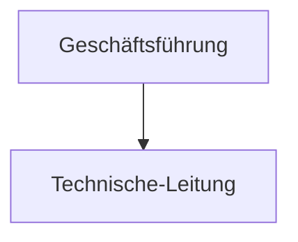
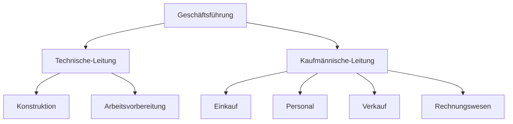

---
tags:
  - bwl
links: 
reference: 
path: Notes
created: 2023-10-14 20:27
modified: 2023-10-14 20:27
---
## Einliniensystem
> System, der in eine [[Unternehme]] verwendet werden kann.
> Jeder Sektor wird angewiesen direkt von den Geschäftsführung und hat kein direkt Kontakt mit den anderen Sektoren.  

___

