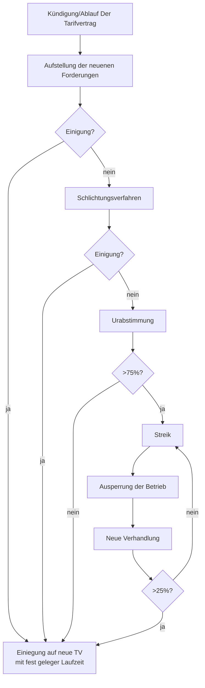

---
tags:
  - klausurrelevant
  - LF01V2
links: 
reference: 
path: Notes
created: 2024-02-07 06:19
modified: 2024-02-07 06:19
---
>Tarifvertrag, Betriebsvereinbarung.

Diese Art von Vertrag passiert immer nach Arbeitsvertrag und es sind Vereinbarungen zwischen der Arbeitgeber und eine Gruppe oder mehrere Gruppe von Angestellter.

>[!note] 
> Die Maschine-Mitarbeiter erhalten eine Lohnerhöhung von 10 Cent.

Diese Art von Vertrag kann auch passiert wenn eine Gruppe sich bessere Arbeitsbedingung vorderen. Somit können Streiks entstehen.

